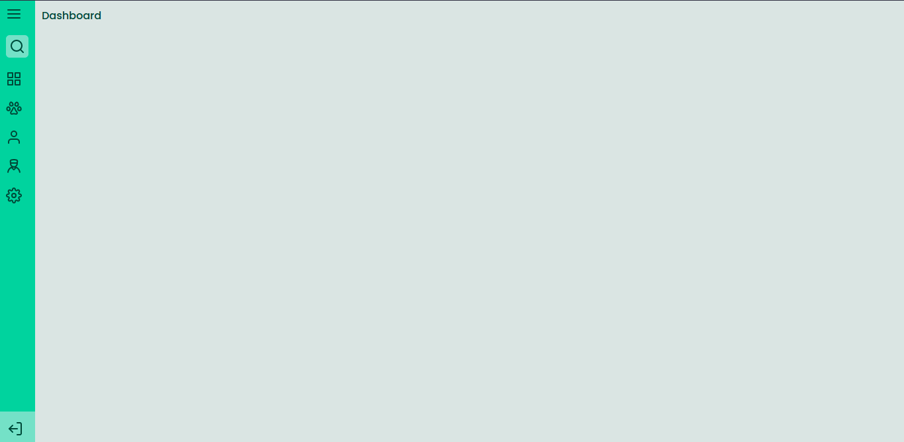
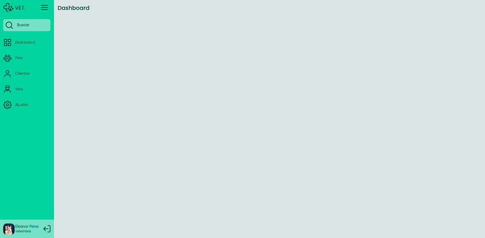

# SideBar

In this project, the goal was create a menu, that could opened or closed, after clicking a button,
in that case i used a humburger menu button.

below has two screenshots showing the menu closed and opened:

